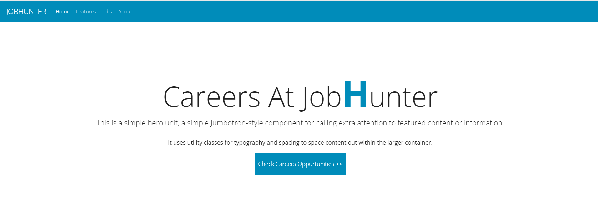
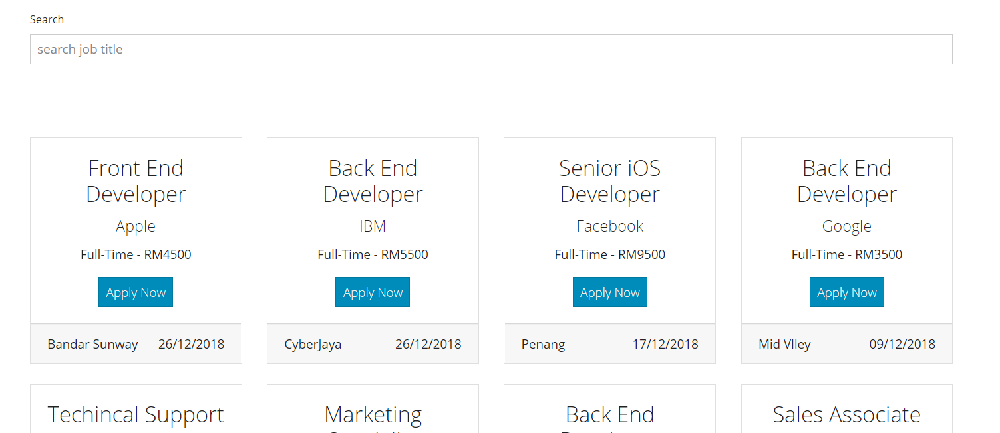
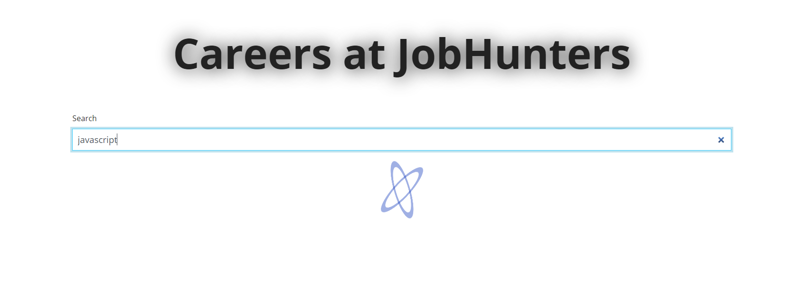
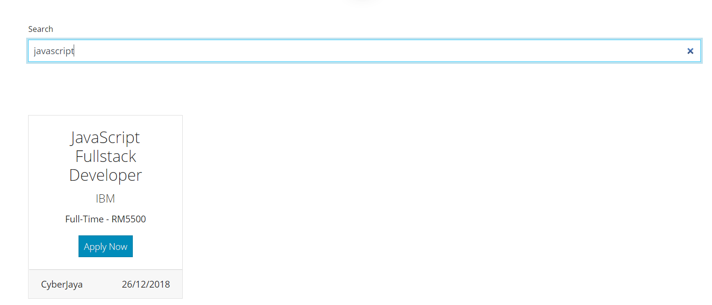
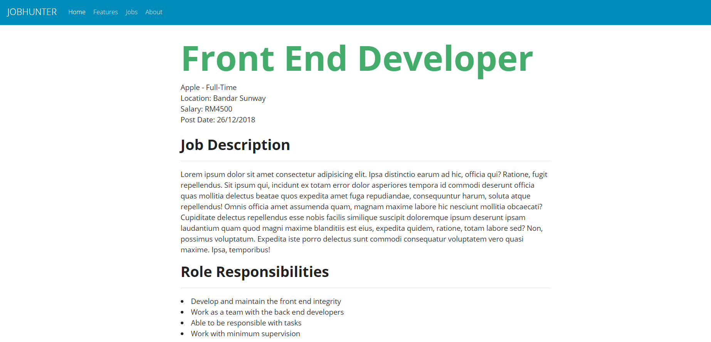
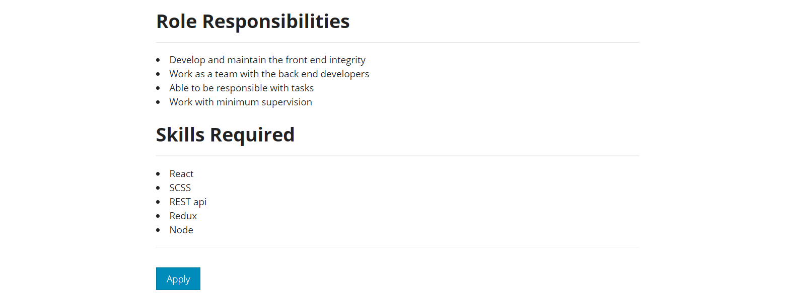
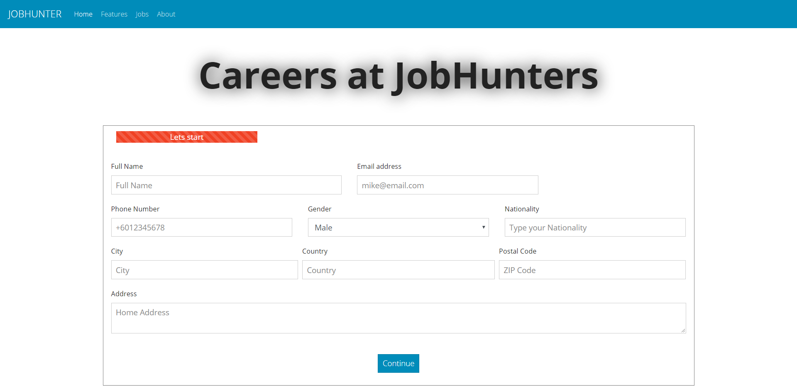
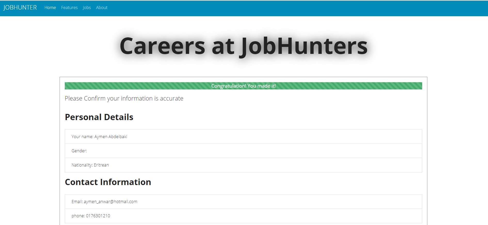
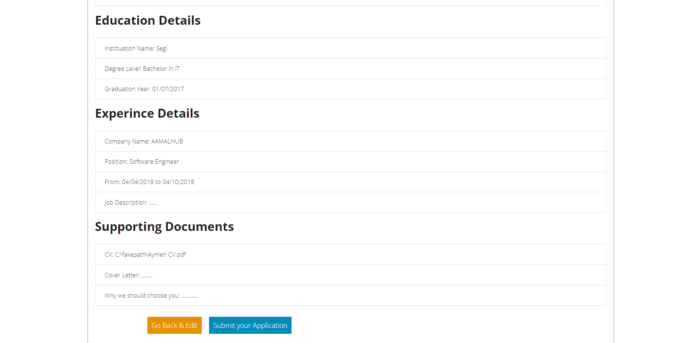
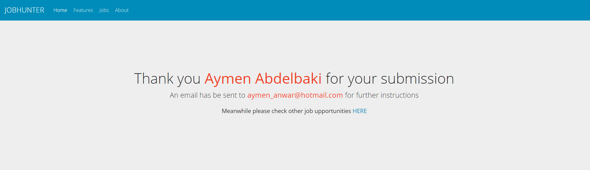

##Screenshots of the web application
  
  
  
  
  
  
  
  
  
  

## Info
This application is developed with creat-react-app 
The data(jobs) are fetched with json-server(localhost) 
It uses a multistepped form holding the state of data in case of modification 

